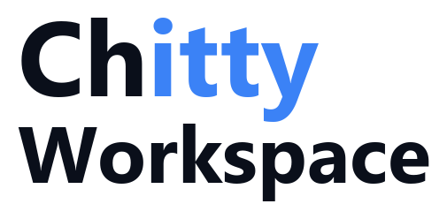

<p align="center">
  
</p>

<p align="center">
  <strong>Your Machine &nbsp;|&nbsp; Your AI &nbsp;|&nbsp; Your Rules</strong>
</p>

<p align="center">
  Local-first AI assistant with agents, tools, browser, and marketplace.<br/>
  Bring your own API keys. No cloud server required.
</p>

<p align="center">
  <a href="https://chitty.ai">chitty.ai</a> &middot;
  <a href="https://chitty.ai/marketplace">Marketplace</a> &middot;
  <a href="docs/application-feature-list.md">Docs</a> &middot;
  <a href="https://github.com/MTPython406/Chitty-Workspace/releases">Download</a>
</p>

<p align="center">
  <a href="https://github.com/MTPython406/Chitty-Workspace/releases"></a>
  <a href="LICENSE"></a>
  
  
</p>

---

## What is Chitty Workspace?

Chitty Workspace is a standalone desktop AI assistant that runs entirely on your machine. Bring your own API keys, install tool packages from the marketplace, automate your browser, and schedule agents to work for you — all without sending data to a third-party server.

**Key highlights:**

- **100% Local** — All data stays on your machine. API keys stored in your OS keyring, never in plain text.
- **Bring Your Own Key** — Use OpenAI, Anthropic, Google, xAI, or run models locally with Ollama.
- **Marketplace Packages** — Extend capabilities with one-click installs: Google Cloud, Gmail, Calendar, Slack, and more.
- **Browser Automation** — Control your real Chrome/Edge browser via the Chitty Browser Extension.
- **Agent System** — Create specialized agents with custom instructions, scoped tools, and scheduled execution.

## Features

| Feature | Description |
|---------|-------------|
| **Default Chitty Agent** | Built-in system administrator that knows your entire setup |
| **Agent Builder** | Describe what you need — Chitty builds the agent for you |
| **Marketplace Packages** | Install tool packages for Google Cloud, Gmail, Calendar, Slack, social media, and more |
| **Sub-Agent Architecture** | Packages generate focused sub-agents scoped to specific datasets or workflows |
| **Browser Automation** | Navigate, click, type, screenshot — agents control your actual browser sessions |
| **Slash Commands** | `/schedule`, `/help`, and more — extensible command system |
| **Agent Scheduler** | Schedule agents to run autonomously on cron expressions |
| **Native Tools** | File operations, terminal commands, code search, web search & scraping |
| **Persistent Memory** | Remembers preferences, project context, and feedback across sessions |
| **Project Context** | Drop a `chitty.md` in any project — Chitty automatically understands it |
| **Multi-Panel** | Run multiple agents side-by-side with cross-panel delegation |
| **Approval System** | Approve once, auto-approve for the session, or set agents to full auto mode |

## Quick Start

### Install

Download the latest installer from [Releases](https://github.com/MTPython406/Chitty-Workspace/releases) and run it. Single binary, no dependencies.

### Build from Source

```bash
# Prerequisites: Rust toolchain (https://rustup.rs)
git clone https://github.com/MTPython406/Chitty-Workspace.git
cd Chitty-Workspace
cargo build --release
```

The binary will be at `target/release/chitty-workspace.exe` (Windows) or `target/release/chitty-workspace` (macOS/Linux).

### Run

```bash
# Start Chitty Workspace (opens system tray + WebView2 UI)
chitty-workspace

# Show configuration
chitty-workspace config

# List installed agents
chitty-workspace agents
```

## Architecture

```
┌──────────────────────────────────────────────────┐
│              Chitty Workspace                     │
├──────────────────────────────────────────────────┤
│  UI (WebView2 + System Tray)                      │
│  ├── Multi-panel chat interface                   │
│  ├── Dynamic Action Panel (browser, media, config)│
│  ├── Agent Builder & Marketplace                  │
│  └── Settings (providers, keys, integrations)     │
├──────────────────────────────────────────────────┤
│  Chat Engine                                      │
│  ├── Context assembly (agent + chitty.md +        │
│  │   memories + tools + history)                  │
│  ├── Tool calling loop with approval system       │
│  ├── Streaming SSE responses                      │
│  └── Slash command system (/schedule, /help)      │
├──────────────────────────────────────────────────┤
│  Agents            │  Providers (BYOK)            │
│  ├── Chitty (sys)  │  ├── OpenAI                  │
│  ├── Custom agents │  ├── Anthropic               │
│  └── Agent Builder │  ├── Google AI               │
│                    │  ├── xAI                      │
│  Tools             │  ├── Ollama (local)           │
│  ├── Native        │  └── HuggingFace (sidecar)   │
│  ├── Custom        │                               │
│  ├── Marketplace   │  Scheduler                    │
│  └── Browser ext.  │  └── Cron-based agent tasks   │
├──────────────────────────────────────────────────┤
│  SQLite (local)    │  OS Keyring (API keys)        │
└──────────────────────────────────────────────────┘
```

## Providers

Bring your own keys. Chitty supports:

| Provider | Type | Models |
|----------|------|--------|
| **OpenAI** | Cloud (BYOK) | GPT-4o, GPT-4o-mini, o1, o3 |
| **Anthropic** | Cloud (BYOK) | Claude Opus, Sonnet, Haiku |
| **Google AI** | Cloud (BYOK) | Gemini 2.5 Flash, Pro |
| **xAI** | Cloud (BYOK) | Grok 3, Grok 3 Mini |
| **Ollama** | Local | Llama, Qwen, Mistral, Phi, etc. |
| **HuggingFace** | Local (sidecar) | Any GGUF model |

## Marketplace Packages

Packages extend Chitty with new tools. Browse and install from the [Chitty Marketplace](https://chitty.ai/marketplace), or build your own.

| Package | Tools | Description |
|---------|-------|-------------|
| [google-cloud](https://github.com/MTPython406/chitty-pkg-google-cloud) | BigQuery, Cloud Storage | Query data and manage storage |
| [google-gmail](https://github.com/MTPython406/chitty-pkg-google-gmail) | Gmail read, send | Read and send email |
| [google-calendar](https://github.com/MTPython406/chitty-pkg-google-calendar) | Calendar list, create, update, delete, freebusy | Manage your calendar |
| web-tools | web_search, web_scraper | Search the web and scrape pages |
| social-media | x_twitter | Post and search on X/Twitter |

See the [Package Development Guide](docs/application-feature-list.md) to build and publish your own packages.

## Building Marketplace Packages

Packages are directories with a `package.json` manifest and tool subdirectories. Each tool has a `manifest.json` and a script (Python, Node, PowerShell, or Shell).

```
my-package/
├── package.json          # Package manifest
├── SKILL.md              # Agent instructions (optional)
├── my-tool/
│   ├── manifest.json     # Tool definition (name, params, instructions)
│   └── tool.py           # Script — reads JSON from stdin, writes JSON to stdout
└── another-tool/
    ├── manifest.json
    └── tool.js
```

Tools receive JSON on stdin and output JSON to stdout:

```python
import sys, json

input_data = json.loads(sys.stdin.read())
params = input_data.get("parameters", {})

result = {"processed": params.get("url"), "status": "ok"}
print(json.dumps({"success": True, "result": result}))
```

Supported runtimes: `python`, `node`, `powershell`, `shell`.

## Data Storage

Everything stays on your machine:

```
~/.chitty-workspace/
├── config.toml              # Settings
├── workspace.db             # SQLite database (conversations, agents, memories, schedules)
├── tools/
│   ├── marketplace/         # Installed marketplace packages
│   └── custom/              # User-created tools
└── models/                  # Local GGUF model files
```

## Local API

Chitty runs a local server at `http://localhost:8770` with a REST API:

| Endpoint | Method | Description |
|----------|--------|-------------|
| `/api/agents` | GET/POST | List or create agents |
| `/api/agents/:id` | GET/PUT/DELETE | Manage a specific agent |
| `/api/agents/:id/sub-agents` | POST | Create a scoped sub-agent |
| `/api/schedules` | GET/POST | List or create scheduled tasks |
| `/api/skills` | GET | List available skills |
| `/api/tools` | GET | List all available tools |
| `/api/marketplace/packages` | GET | List installed packages |
| `/api/providers` | GET | List configured providers |

## Tech Stack

- **Language:** Rust (2021 edition)
- **Async Runtime:** Tokio
- **UI:** System tray (tray-icon + tao) + WebView2 (wry)
- **Storage:** SQLite (rusqlite, WAL mode)
- **HTTP:** reqwest (LLM API calls) + axum (local UI server)
- **Scheduling:** cron crate
- **Secure Storage:** OS keyring (keyring crate)

## Contributing

Chitty Workspace is open source and we welcome contributions! Please see our contributing guidelines (coming soon) for details.

## License

[MIT](LICENSE)

---

<p align="center">
  Built by <a href="https://datavisions.ai">DataVisions.ai</a><br/>
  <a href="https://chitty.ai">chitty.ai</a> — Free, open-source AI desktop assistant
</p>
